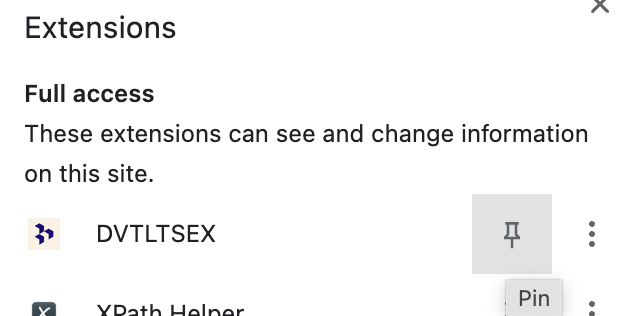

## Description

-----------------------------

Dovetail Transcript Export it is a Google Chrome extension that allows you to export your Dovetail transcript directly into the Fibery rich-text field.

### Currently supported features:

- [x] Automatic checking out for appropriate transcript available

- [x] Export Dovetail transcript via Markdown to Fibery rich-text

- [x] User's custom Fibery access token (for proper entity changelog)

- [x] Export to Entity (now Customer Feedback/Conversation only) by its public id

- [x] Storing of each User's Fibery access token independently between sessions and devices

- [x] Custom error messages

### Installation

1. Download the last extension version (archive) from the [Releases page](https://github.com/infludb-inc/dovetail-export/releases "https://github.com/infludb-inc/dovetail-export/releases")

2. Unpack this archive wherever you want on your PC

3. Navigate to [chrome://extensions]( chrome://extensions " chrome://extensions") page

4. Click `Developer Mode` at the top right corner of the page

   

5. Select the `Load Unpacked` option

   

6. Choose the folder where you unpacked your download

7. Pin the extension to your Chrome toolbar as shown below

   
